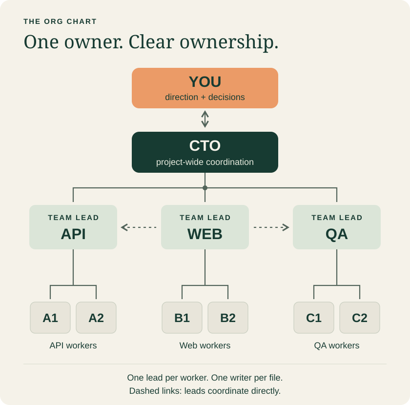
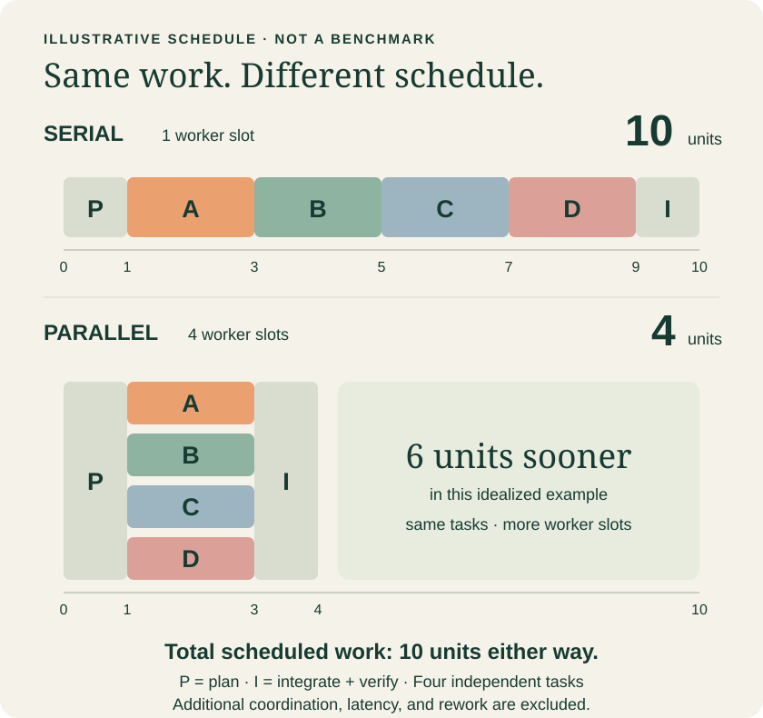

<p align="center">
  
</p>

<h1 align="center">AI-Company</h1>

<p align="center"><strong>Run a large project with your own AI engineering company.</strong></p>
<p align="center">You set the direction. A CTO coordinates the teams.<br>Team leads manage the details. Workers build in parallel.</p>

<p align="center"><strong>English</strong> · <a href="README.zh-CN.md">中文</a> · <a href="AGENTS.md">Start here, agents</a> · <a href="WORKFLOW.md">Full workflow</a></p>

---

You have a big project, several workstreams, and more agent conversations than you want to supervise. Give each team a clear owner and let a CTO keep the work connected.

**Your job: choose the destination, resolve meaningful tradeoffs, and review what ships.** Your leads handle task briefs, workers, dependencies, and evidence. You can talk to the CTO or any lead without becoming the message courier for every worker.

AI-Company is a small, readable operating playbook for **large software projects with multiple AI teams**. Bring your coding assistant and its task tools. The repository supplies the roles, communication rules, handoffs, and delivery contract.

## Meet your company



| You talk to | They take care of |
| --- | --- |
| **CTO** | Project direction, team ownership, shared design, conflicts, duplicate work, and integration order |
| **Team leads** | A complete workstream: planning, worker assignments, review, fixes, and delivery |
| **Workers stay with their lead** | A bounded implementation, investigation, test, or independent review |

Leads can coordinate directly. They settle facts and handoffs within their assigned scope, then report consequential agreements to the CTO. Changes to shared design, ownership, priorities, or acceptance criteria go to the CTO. Your explicit decisions do not need a second approval.

## Same work. A shorter critical path.



**The picture is a scheduling example, not a benchmark.** Both schedules contain the same work: 1 planning unit + 4 independent tasks × 2 units + 1 integration unit. Serial execution uses one worker slot; parallel execution uses four. Ideal elapsed time is **10 → 4 units**, while total scheduled work stays **10 units**.

Real coordination, model latency, rate limits, dependencies, and rework can reduce or eliminate the gain. This diagram makes no claim about token savings, API cost, or measured product performance.

> Parallelize independent work. Keep shared decisions and integration coordinated.

## Put the playbook to work

**1. Open the project you want to build in your AI coding tool.** Clone or download this repository somewhere the assistant can read it, or provide the repository URL if it can browse files.

```sh
git clone https://github.com/Timking123/AI-Company.git
```

**2. Give your assistant this brief.** Include the local path or link to this repository.

```text
Read AI-Company's AGENTS.md and follow its reading order.
Apply this workflow to my current project. I am the human owner.

Start by checking your available tools, project rules, and existing work.
Establish one CTO and reuse existing leads before creating new teams.
Where your host permits it, create durable, visible tasks for the leads
and workers that this project actually needs. Assign one manager and
an exclusive write scope to each worker.

Keep me informed through the CTO and team leads. Let leads coordinate
within their scope; escalate shared decisions to the CTO. Preserve my
existing permissions and project quality gates.

First return the capability check, ownership map, and next executable
steps. If a required tool is missing, explain the smallest manual step
instead of claiming the company is already running.
```

**3. Review the first checkpoint.** You should see actual task identities, clear ownership, dependencies, and the next action for each active workstream. A drawn org chart alone is not a running team.

Using Codex? Read the [Codex setup notes](docs/CODEX.md). The protocol also describes how to recognize missing capabilities on other hosts; compatibility must be checked rather than assumed.

## A few rules that make the company work

- **One worker, one manager.** A worker follows its creating lead or a formally registered successor. The CTO coordinates through leads.
- **One file, one writer.** Independent write tasks get isolated checkouts and explicit scopes. Shared contracts and integration have named owners.
- **Reuse before recruiting.** Check existing tasks, code, and decisions before creating another team or abstraction. Scale concurrent work to review and integration capacity.
- **Updates keep work moving.** Leads report your requests and decisions to the CTO. Reporting does not add another approval to work you have already authorized.
- **Ship evidence.** Implementation, verification, integration, and deployment are separate milestones. A changed candidate needs the checks required for that candidate.
- **Keep useful lessons.** Leads keep scoped notes and reusable methods. The CTO decides which lessons belong in project rules.

Small fixes can stay with one lead. You do not need a company meeting to change a button label.

## Read the part you need

| File | Reader | What you get |
| --- | --- | --- |
| [AGENTS.md](AGENTS.md) | The assistant entering the repository | Reading order, adoption boundary, and first actions |
| [WORKFLOW.md](WORKFLOW.md) | CTOs and leads | The complete coordination and delivery protocol |
| [Role prompts](docs/ROLES.md) | Whoever creates a role | Ready-to-copy CTO, lead, and worker briefs |
| [Templates](docs/TEMPLATES.md) | Leads and workers | Scope, updates, dependency handoffs, and acceptance evidence |
| [Worked examples](docs/EXAMPLES.md) | Anyone trying the workflow | A parallel feature and a manager handover, using fictional data |
| [Codex notes](docs/CODEX.md) | Codex users | Capability checks and the distinction between visible tasks and temporary subagents |
| [Validation scenarios](docs/VALIDATION.md) | Maintainers and adopters | Concrete situations to check before trusting a setup |

## What to expect

This is an **experimental, documentation-first workflow**. It does not install an orchestrator, enforce file locks, or provide an agent runtime. Your host must supply the task, communication, filesystem, and version-control capabilities used by the workflow. Models can still misunderstand instructions; use the bootstrap checks and acceptance scenarios.

Use your preferred capable planning model for CTOs and leads, with a supported high-reasoning setting. A quality-first setup can select the current flagship model and the highest supported effort. Record the actual model and setting, respect user choices, and keep application or evaluation model settings separate.

## Make it better

Try the playbook on a bounded workstream. Share a sanitized example of what worked, where a handoff failed, or which instruction caused extra work. Useful evidence includes repeated tasks, human interruptions, integration waiting time, and the final acceptance result.

Keep proposed additions small. Prefer a clearer rule or example over another management layer.

[Open an issue](https://github.com/Timking123/AI-Company/issues) · [MIT license](LICENSE) · [Sources and artwork](docs/SOURCES.md)
